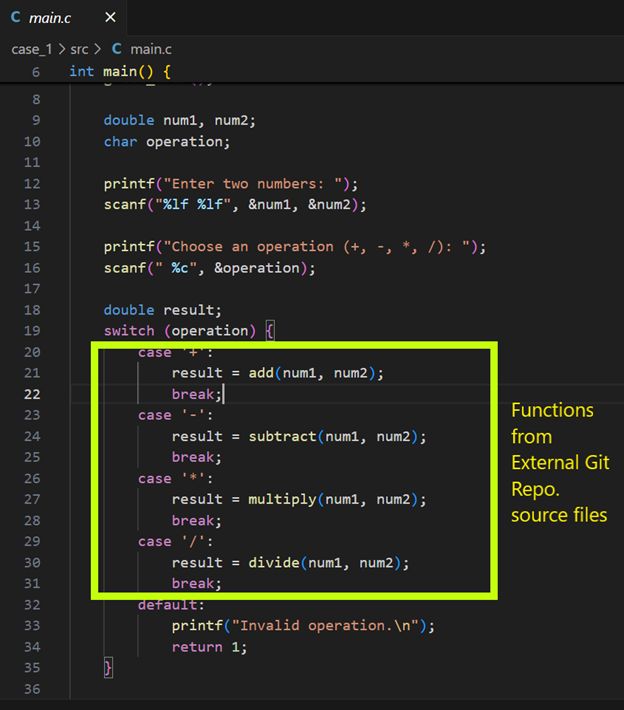
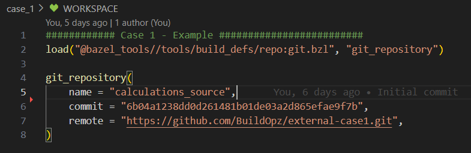
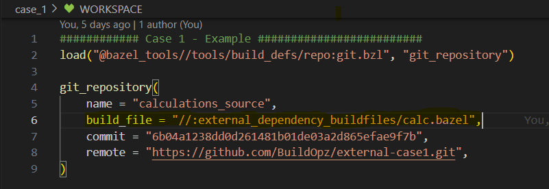
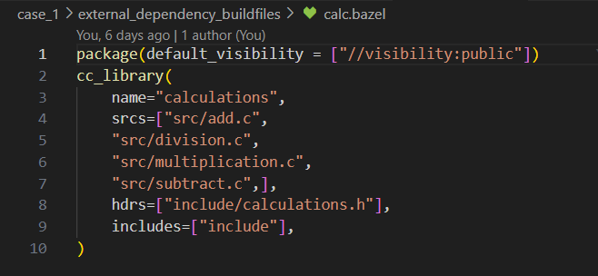
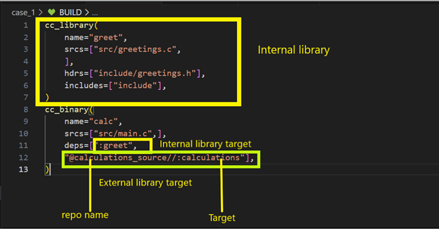

# Case 1: Incorporating Third-party Source Code into Your Bazel Workspace

## Objective
Learn how to incorporate source code from third-party repositories into your Bazel workspace.

## Prerequisites
- Basic understanding of Bazel workspaces and `BUILD` files.
- Access to a third-party repository or source code package.

## **Folder structure**:

```
case_1/
├── BUILD                              # Bazel build file defining 
├── WORKSPACE                          # Bazel workspace file for 
├── external_dependency_buildfiles/    # Directory for third-party dependencies
│   └── calc.bazel                     # Build file for external 
├── src/                               # Project source code
│   ├── greetings.c                    # Internal file for source code
│   └── main.c                         # Main application file

└── include/
    └──greetings.h                     # header files
```

## Steps

Here we have a sample calculator program which only has this structure available.
```
src/                               
├── greetings.c                    
└── main.c                         
└── include/
    └──greetings.h
```
1. Firstly we will introduce a WORKSPACE file in the root folder to make it a `bazel workspace`


    Here main.c is not having any logic to do the calculation and I want to utilize external [repository](https://github.com/BuildOpz/external-case1) to do the calculation. Here is how my main.c code looks like.

    

2. Now the external functions that we are utilizing in code is not available locally in our system. In order to get the external repository locally we need to modify the workspace file like this

    

Here are details for each key value pair
- **name:** Name of the package it is downloading which can be anything
- **remote:** Location where to download the package from
- **commit:** Specific commit it needs to download

3. If you check the external [repository](https://github.com/BuildOpz/external-case1) source code you will see that no `BUILD` file available in this repository. So we will need to inject our own bazel build file to make it part of the bazel repository.

    So we will create a bazel build file in `external_dependency_buildfiles/calc.bazel` and inject it in external downloaded repository with the help of `WORKSPACE` file. Now our `WORKSPACE` file looks like this

    

Here we have introduced a key value pain `build_file`. Which will be injected in external repository workspace after the download. Here is the content for calc.bazel
    


4. Now we will introduce a `BUILD` file in our workspace in order to consume the external repository in our code.
   

5. Finally you can run the command for target to be built using
   
   `bazel build -s calc --verbose_failures`